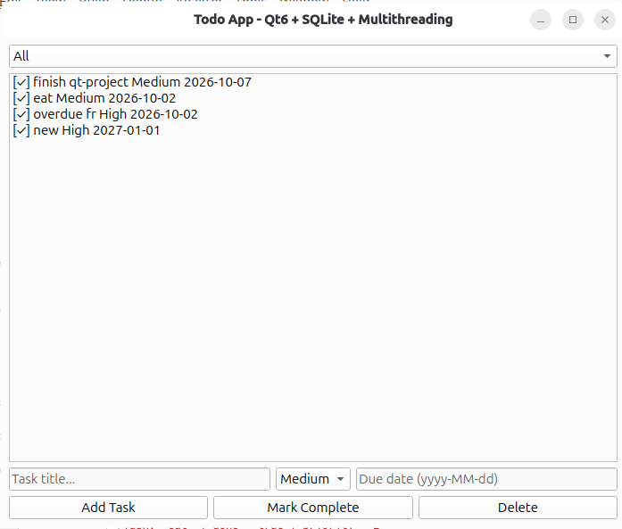
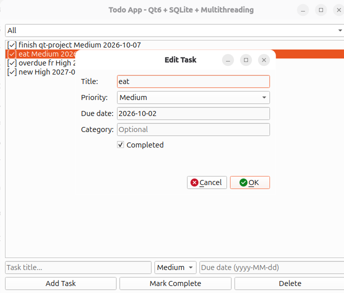
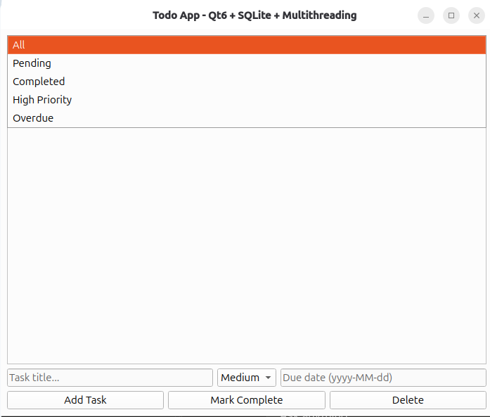

# TodoQt

A modern desktop Todo application built with **Qt 6**, **SQLite**, and **multithreading** in C++17.


## Features

- Add, edit, complete, and delete tasks
- Priority levels (Low / Medium / High)
- Optional due dates
- Filter tasks (All, Pending, Completed, High Priority, Overdue)
- Overdue tasks highlighted in red
- Persistent storage using **SQLite**
- Database operations run in a **background thread** (UI stays responsive)
- Clean architecture using the Worker + Signals/Slots pattern

## Technologies Used

- **C++17**
- **Qt 6** (Widgets + SQL modules)
- **SQLite**
- Multithreading with `QThread` and worker object
- CMake

## Architecture

UI Thread (MainWindow)

│

│  signals / slots

▼

Worker Thread (TaskWorker)

│

▼
DatabaseManager  ←→  SQLite (tasks.db)


This separation keeps the user interface responsive while all database work happens in the background.

## How to Build

### Requirements
- Qt 6
- CMake ≥ 3.16
- C++17 compiler (GCC, Clang, or MSVC)

### Build steps

```bash
git clone https://github.com/kingeazi941/TodoQt.git
cd TodoQt
mkdir build && cd build
cmake ..
cmake --build .
./TodoQt
```

## Project Structure
TodoQt/

├── main.cpp

├── MainWindow.h / .cpp

├── Task.h

├── DatabaseManager.h / .cpp

├── TaskWorker.h / .cpp

├── EditTaskDialog.h / .cpp

├── screenshots/

└── CMakeLists.txt

## Screenshots
### Main Window


### Edit Task Dialog


### Filters


## Future Improvements
- Search functionality
- Categories / tags
- Export to CSV
- Dark theme
- System tray notifications for overdue tasks

## Author
**Afun Ezekiel**


## License
This project is open source and available under the MIT License.